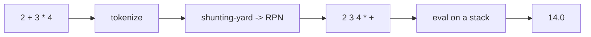

# Calculator · Advanced

> Project 01 of 50 · Level: 🚀 Advanced · Interface: CLI + Tkinter GUI

## 1. Project Overview
A production-quality calculator that evaluates whole expressions like `2 + 3 * (4 - 1) ** 2` safely, without `eval()`. It uses a hand-written tokenizer and the shunting-yard algorithm, wraps everything in a `Calculator` class with logging and a custom exception, ships a Tkinter GUI, and is covered by a pytest suite. This is what real software looks like.

## 2. Learning Objectives
- Tokenize a string and parse it with the shunting-yard algorithm.
- Evaluate Reverse Polish Notation (RPN).
- Design with OOP: dataclasses, a service class, custom exceptions.
- Apply full type hints and structured `logging`.
- Separate concerns: engine (`models`) vs interface (`gui`/`main`) vs config.
- Write and run a `pytest` suite.

## 3. Prerequisites
Comfort with classes, virtual environments, `pip`, and the command line. Familiarity with the Intermediate variant's module split.

## 4. Setup Instructions
```bash
python -m venv .venv
source .venv/bin/activate   # Windows: .venv\Scripts\activate
pip install -r requirements.txt
```
Tkinter ships with CPython, so the only dependency is `pytest` for tests.

## 5. Key Concepts
**Tokenizing** turns `"2 + 3"` into `[NUMBER 2, OP +, NUMBER 3]`.
**Shunting-yard** reorders infix tokens into RPN, respecting precedence (`**` > `*` `/` `%` > `+` `-`), associativity (`**` is right-associative), parentheses, and unary minus.
**RPN evaluation** uses a stack: push numbers, pop operands when you hit an operator.
**Why no `eval`?** `eval(user_input)` can run arbitrary code. A parser is safe by construction.



## 6. Glossary
| Term | Meaning |
|---|---|
| Token | A smallest meaningful unit (number, operator, paren). |
| RPN | Postfix notation: operator after operands. |
| Shunting-yard | Dijkstra's infix-to-RPN algorithm. |
| Associativity | Which side binds first for equal precedence. |
| Dataclass | A class that auto-generates `__init__` etc. |
| Type hint | An annotation like `-> float` describing types. |

## 7. Predict the Output
```python
print(2 ** 3 ** 2)
```
<details><summary>Reveal</summary>

`512`. `**` is right-associative, so it is `2 ** (3 ** 2) = 2 ** 9`.
</details>

## 8. Complete Source Code
The full sources live alongside this guide: [`models.py`](./models.py) (engine), [`gui.py`](./gui.py) (Tkinter UI), [`main.py`](./main.py) (entry point), [`config.py`](./config.py) (settings + logging), and [`tests.py`](./tests.py). The heart is `models.py`:

```python
class CalculatorError(Exception):
    """Raised when an expression cannot be parsed or evaluated."""


def tokenize(expression: str) -> list[Token]: ...
def to_rpn(tokens: list[Token]) -> list[Token]: ...
def eval_rpn(rpn: list[Token]) -> float: ...


class Calculator:
    def evaluate(self, expression: str) -> float:
        if not expression or not expression.strip():
            raise CalculatorError("Expression is empty.")
        tokens = tokenize(expression)
        rpn = to_rpn(tokens)
        result = eval_rpn(rpn)
        self._history.append(HistoryEntry(expression.strip(), result))
        return result
```

See the repository files for the complete, runnable implementation (tokenizer, shunting-yard with unary-minus handling, and RPN evaluation).

## 9. Code Walkthrough
**`config.py`** centralizes app metadata and sets up `logging`. **`models.py`** is the pure engine: `Token` (a frozen dataclass), `tokenize` (a hand-written lexer), `to_rpn` (shunting-yard, detecting unary minus by looking at the previous token), `eval_rpn` (stack machine), and the `Calculator` service class holding history via `HistoryEntry`. **`gui.py`** is a thin Tkinter layer that only builds widgets and calls `Calculator.evaluate`. **`main.py`** parses args and dispatches to REPL, GUI (`--gui`), or one-shot evaluation. The engine never imports the UI, so it stays testable in isolation.

## 10. Execution Instructions
```bash
python main.py            # interactive REPL
python main.py --gui      # Tkinter calculator
python main.py "2 + 3*4"  # evaluate once -> 14.0
pytest tests.py           # run the test suite
```

## 11. Expected Output
```text
$ python main.py "2 + 3 * (4 - 1) ** 2"
29.0

$ pytest tests.py
============ test session starts ============
collected 17 items
tests.py .................                 [100%]
============= 17 passed in 0.05s ============
```

## 12. Common Errors
| Error | Cause | Fix |
|---|---|---|
| `CalculatorError: Unexpected character` | Letters/symbols in the expression | Use only numbers, `+ - * / % **`, parens. |
| `CalculatorError: Unbalanced parentheses` | Mismatched `(` `)` | Balance your brackets. |
| `TclError` on `--gui` | No display (headless server) | Run the GUI on a desktop session. |
| `ModuleNotFoundError: pytest` | Deps not installed | `pip install -r requirements.txt`. |

## 13. Real-World Applications
Tokenizers and parsers power compilers, SQL engines, spreadsheet formulas, template languages, and search-query parsing. The engine/UI separation here mirrors how real apps keep business logic independent of any front end. Never trusting user input (no `eval`) is a core security practice.

## 14. Deep Dive: precedence and associativity
The `_PRECEDENCE` table encodes both a level and a right-associativity flag. The shunting-yard loop pops higher-or-equal-precedence operators before pushing the current one, except for right-associative operators (`**`, unary minus), where it stops at strictly-higher precedence. That single rule is why `2 ** 3 ** 2` groups as `2 ** (3 ** 2)`. Extend the table with functions (`sin`, `sqrt`) or constants (`pi`) to grow the language.

## 15. Practice Challenges
1. Add functions like `sqrt()` and `abs()` to the grammar.
2. Persist history to `data/history.json` like the Intermediate variant.
3. Add keyboard bindings for every operator in the GUI.
4. Support constants `pi` and `e`.
5. Add a `--json` flag that prints results as JSON, and test it.

## 16. Knowledge Check
1. Why avoid `eval()` on user input? *(it can execute arbitrary code)*
2. What does shunting-yard convert infix to? *(RPN / postfix)*
3. How is `2 ** 3 ** 2` grouped and why? *(`2 ** (3 ** 2)`; `**` is right-associative)*

## 17. Next Project
You've completed Project 01 at all three levels. Continue to **[Project 02 · To-Do List](../../02-To-Do-List)** to apply CRUD and persistence to a new domain.
