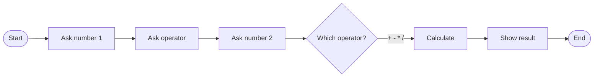

# Calculator · Beginner

> Project 01 of 50 · Level: 🌱 Beginner · Interface: Console

## 1. Project Overview
Your very first program: a friendly console calculator that takes two numbers and an operator, then prints the answer. No libraries, no setup headaches, just Python and you. You'll learn the input, decide, compute, output loop that is the heartbeat of almost every program ever written.

## 2. Learning Objectives
By the end you will be able to:
- Read input with `input()` and convert it to a number.
- Write and call your own functions with parameters and return values.
- Use `if / elif / else` to choose between actions.
- Catch a bad value with `try / except` so the program doesn't crash.
- Guard against dividing by zero and explain the problem kindly.

## 3. Prerequisites
| You need | Details |
|---|---|
| Python 3.11+ | Check with `python --version`. |
| A text editor | VS Code or anything that saves `.py` files. |
| Zero prior code | Seriously, this is a first program. |

## 4. Setup Instructions
1. Make a folder and open it in your editor.
2. Create `main.py`.
3. Paste the source from section 8.
4. Open a terminal in that folder.

No `pip install` needed. This uses only what ships with Python.

## 5. Key Concepts
**Everything from `input()` is text.** Typing `5` gives you the string `"5"`, not the number 5, so we convert with `float()`.
**Functions are reusable machines.** They take input, do a job, return something. We build `get_number()`, `get_operator()`, `calculate()`.
**`try / except` stops crashes.** `float("banana")` would crash; we catch the error and ask again.



## 6. Glossary
| Term | Meaning |
|---|---|
| String | Text in quotes, like `"5"`. |
| Float | A number with a decimal point, like `3.14`. |
| Function | A named block of code you can run on demand. |
| Parameter | A value you hand to a function. |
| Return | The value a function gives back. |
| Exception | Python's way of saying something went wrong. |
| Loop | Code that repeats until told to stop. |

## 7. Predict the Output
```python
def add(a, b):
    return a + b

print(add(2, 3) * 2)
```
<details><summary>Reveal</summary>

**10.** `add(2, 3)` returns `5`, then `5 * 2` is `10`.
</details>

## 8. Complete Source Code
```python
"""Beginner Calculator.

Asks the user for two numbers and one operator (+, -, *, /),
then prints the result. Uses only Python's built-in features.
"""


def get_number(prompt):
    """Ask for a number, repeating until the user types a valid one."""
    while True:
        raw_value = input(prompt)
        try:
            return float(raw_value)
        except ValueError:
            print("  That doesn't look like a number. Try again.")


def get_operator():
    """Ask for one of the four supported operators."""
    valid_operators = ("+", "-", "*", "/")
    while True:
        operator = input("Choose an operator (+, -, *, /): ").strip()
        if operator in valid_operators:
            return operator
        print("  Please type one of: + - * /")


def calculate(first_number, operator, second_number):
    """Return the result of applying the operator to the two numbers."""
    if operator == "+":
        return first_number + second_number
    if operator == "-":
        return first_number - second_number
    if operator == "*":
        return first_number * second_number
    if operator == "/":
        if second_number == 0:
            return "Error: you cannot divide by zero."
        return first_number / second_number
    return "Error: unknown operator."


def main():
    """Run the calculator once, from start to finish."""
    print("=" * 40)
    print("        Welcome to the Calculator")
    print("=" * 40)

    first_number = get_number("Enter the first number:  ")
    operator = get_operator()
    second_number = get_number("Enter the second number: ")

    result = calculate(first_number, operator, second_number)

    print("-" * 40)
    print(f"Result: {first_number} {operator} {second_number} = {result}")
    print("-" * 40)


if __name__ == "__main__":
    main()
```

## 9. Code Walkthrough
**`get_number()`** loops with `while True`, tries `float()`, and on `ValueError` prints a note and asks again. **`get_operator()`** only returns when the input is one of four symbols; `.strip()` removes stray spaces. **`calculate()`** picks the operation with `if` checks and returns a message instead of crashing on divide-by-zero. **`main()`** wires it together; `if __name__ == "__main__"` runs it only when the file is started directly.

## 10. Execution Instructions
```bash
python main.py
```
Follow the prompts: number, operator, number.

## 11. Expected Output
```text
========================================
        Welcome to the Calculator
========================================
Enter the first number:  12
Choose an operator (+, -, *, /): *
Enter the second number: 4
----------------------------------------
Result: 12.0 * 4.0 = 48.0
----------------------------------------
```

## 12. Common Errors
| Error | Cause | Fix |
|---|---|---|
| `ValueError` | Text where a number was expected | The loop handles it; type a number. |
| `ZeroDivisionError` | Dividing by zero | We check for it and return a message. |
| `SyntaxError` | Missing colon or bracket | Read the line number Python points to. |
| `IndentationError` | Mixed tabs/spaces | Use 4 spaces per level. |

## 13. Real-World Applications
Validate input, choose an action, compute, report: that is how a checkout totals a cart, a bank applies interest, a spreadsheet evaluates a formula. Input validation is a skill you'll use in every serious program.

## 14. Deep Dive: why `float` not `int`?
`float()` lets users enter decimals. Floats are binary, which is why `0.1 + 0.2` equals `0.30000000000000004`. For money, use `decimal.Decimal`. The Advanced variant explores this further.

## 15. Practice Challenges
1. Add a power operator `**`.
2. Loop with "Calculate again? (y/n)".
3. Add remainder `%` with its own zero check.
4. Round non-whole results to 2 decimals.
5. Let the user type `12 * 4` on one line and split it yourself.

## 16. Knowledge Check
1. What type does `input()` always return? *(string)*
2. Why wrap `float(raw_value)` in `try/except`? *(so bad input doesn't crash the program)*
3. What does `calculate(6, "/", 0)` return? *(an error message string)*

## 17. Next Project
Continue to the **[Intermediate](../Intermediate/GUIDE.md)** calculator: a menu, validation, and saved history. Or jump to **[Project 02 · To-Do List](../../02-To-Do-List)**.
