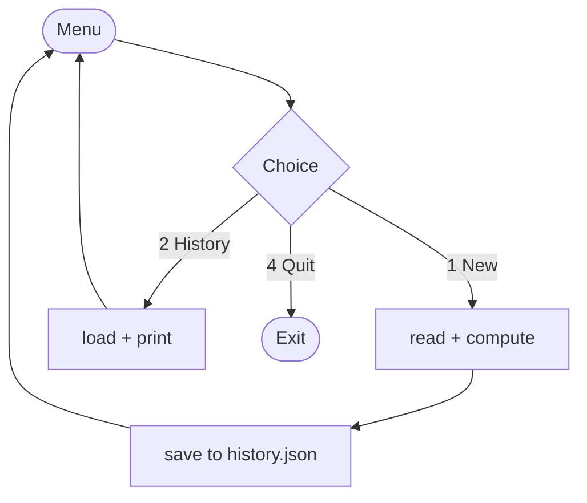

# Calculator · Intermediate

> Project 01 of 50 · Level: ⚙️ Intermediate · Interface: Menu-driven console

## 1. Project Overview
The same calculator, grown up. This version runs a menu loop, validates every input, and remembers every calculation by saving it to `data/history.json`. You'll also meet your first multi-file program: logic in `main.py`, reusable helpers in `utils.py`.

## 2. Learning Objectives
- Split a program across modules and `import` between them.
- Build a menu loop that runs until the user quits.
- Raise and catch specific exceptions (`ZeroDivisionError`, `ValueError`).
- Read and write JSON files for persistence.
- Keep functions small and single-purpose.

## 3. Prerequisites
Comfort with the Beginner variant: functions, `if/elif/else`, `try/except`, and running a script from the terminal. Knowing what a list and dict are will help.

## 4. Setup Instructions
1. Create a folder with `main.py` and `utils.py`.
2. Paste both files from section 8.
3. Run `python main.py`. The `data/` folder and `history.json` are created automatically on your first calculation.

Stdlib only, so no `pip install`.

## 5. Key Concepts
**Modules and imports.** `main.py` imports helpers from `utils.py`. Keeping the menu separate from the plumbing makes each file easier to read and test.
**Raising exceptions.** Instead of returning an error string, `compute()` raises `ZeroDivisionError`, and the caller decides how to react. This is cleaner as programs grow.
**JSON persistence.** We serialize a list of dicts to disk with `json.dump` and read it back with `json.load`, so history survives between runs.



## 6. Glossary
| Term | Meaning |
|---|---|
| Module | A `.py` file you can import from another. |
| Import | Bringing names from one module into another. |
| Raise | Deliberately triggering an exception. |
| Serialize | Turning data into a storable form (here, JSON). |
| Persistence | Data that survives after the program exits. |
| Set | An unordered collection of unique items, like `{"+", "-"}`. |

## 7. Predict the Output
```python
import json
data = [{"x": 1}, {"x": 2}]
print(json.dumps(data))
```
<details><summary>Reveal</summary>

`[{"x": 1}, {"x": 2}]` as a single JSON string.
</details>

## 8. Complete Source Code
**`utils.py`**
```python
"""Helper functions for the Intermediate calculator."""

import json
import os
from datetime import datetime

DATA_DIR = os.path.join(os.path.dirname(__file__), "data")
HISTORY_FILE = os.path.join(DATA_DIR, "history.json")
OPERATORS = {"+", "-", "*", "/"}


def read_number(prompt):
    """Prompt until the user enters a valid number, then return it as a float."""
    while True:
        raw = input(prompt).strip()
        try:
            return float(raw)
        except ValueError:
            print("  Invalid number. Try again (example: 3.14).")


def read_operator(prompt):
    """Prompt until the user enters a supported operator."""
    while True:
        operator = input(prompt).strip()
        if operator in OPERATORS:
            return operator
        print(f"  Unsupported. Choose one of: {' '.join(sorted(OPERATORS))}")


def compute(a, op, b):
    """Apply op to a and b. Raises ZeroDivisionError / ValueError."""
    if op == "+":
        return a + b
    if op == "-":
        return a - b
    if op == "*":
        return a * b
    if op == "/":
        if b == 0:
            raise ZeroDivisionError("Division by zero is undefined.")
        return a / b
    raise ValueError(f"Unknown operator: {op!r}")


def load_history():
    """Return saved history as a list, or [] if none exists."""
    if not os.path.exists(HISTORY_FILE):
        return []
    try:
        with open(HISTORY_FILE, "r", encoding="utf-8") as file:
            return json.load(file)
    except (json.JSONDecodeError, OSError):
        return []


def save_entry(expression, result):
    """Append one calculation to the history file, creating it if needed."""
    os.makedirs(DATA_DIR, exist_ok=True)
    history = load_history()
    history.append({
        "expression": expression,
        "result": result,
        "timestamp": datetime.now().isoformat(timespec="seconds"),
    })
    with open(HISTORY_FILE, "w", encoding="utf-8") as file:
        json.dump(history, file, indent=2)
```

**`main.py`**
```python
"""Intermediate Calculator: menu-driven console app with saved history."""

from utils import compute, load_history, read_number, read_operator, save_entry

MENU = """
==============================
         CALCULATOR
==============================
  1) New calculation
  2) View history
  3) Clear the screen
  4) Quit
------------------------------"""


def do_calculation():
    a = read_number("First number:  ")
    op = read_operator("Operator (+ - * /): ")
    b = read_number("Second number: ")
    try:
        result = compute(a, op, b)
    except ZeroDivisionError as error:
        print(f"  {error}")
        return
    print(f"  = {result}")
    save_entry(f"{a} {op} {b}", result)


def show_history():
    history = load_history()
    if not history:
        print("  No calculations yet.")
        return
    print("  --- History ---")
    for index, entry in enumerate(history, start=1):
        print(f"  {index:>3}. {entry['expression']} = {entry['result']}"
              f"   ({entry['timestamp']})")


def main():
    while True:
        print(MENU)
        choice = input("Choose an option (1-4): ").strip()
        if choice == "1":
            do_calculation()
        elif choice == "2":
            show_history()
        elif choice == "3":
            print("\n" * 3)
        elif choice == "4":
            print("Goodbye!")
            break
        else:
            print("  Please choose a number from 1 to 4.")


if __name__ == "__main__":
    main()
```

## 9. Code Walkthrough
`utils.py` owns validation (`read_number`, `read_operator`), maths (`compute`, which now *raises* instead of returning strings), and persistence (`load_history`, `save_entry`). `main.py` owns the menu loop and delegates everything else. `save_entry` calls `os.makedirs(..., exist_ok=True)` so the `data/` folder is created on demand, then appends a timestamped record and rewrites the JSON file.

## 10. Execution Instructions
```bash
python main.py
```

## 11. Expected Output
```text
==============================
         CALCULATOR
==============================
  1) New calculation
  ...
Choose an option (1-4): 1
First number:  8
Operator (+ - * /): /
Second number: 2
  = 4.0
```

## 12. Common Errors
| Error | Cause | Fix |
|---|---|---|
| `ModuleNotFoundError: utils` | Running from the wrong folder | Run `python main.py` from inside the `Intermediate/` folder. |
| `JSONDecodeError` | Corrupt history file | `load_history` already falls back to `[]`. |
| `ZeroDivisionError` | Dividing by zero | Caught in `do_calculation`; a message prints. |

## 13. Real-World Applications
Menu loops power CLI tools everywhere (git, npm, aws). JSON persistence is how countless apps store settings and small datasets. Splitting logic from I/O is the foundation of testable software.

## 14. Deep Dive: why raise instead of return?
Returning `"Error: ..."` mixes results with errors, forcing every caller to string-check. Raising an exception separates the happy path from failure handling and lets errors bubble up to whoever is best placed to handle them. The Advanced variant builds a custom `CalculatorError` for exactly this reason.

## 15. Practice Challenges
1. Add a menu option to clear the history file.
2. Support `**` and `%` in `compute` and `OPERATORS`.
3. Show only the last 5 history entries.
4. Store results rounded to 4 decimals.
5. Add a running total across the session.

## 16. Knowledge Check
1. Where does the history get saved? *(`data/history.json`)*
2. What does `compute` do on divide-by-zero? *(raises `ZeroDivisionError`)*
3. Why keep helpers in `utils.py`? *(separation of concerns / reuse / testability)*

## 17. Next Project
Level up to the **[Advanced](../Advanced/GUIDE.md)** calculator: a safe expression parser, OOP, a Tkinter GUI, and a pytest suite.
